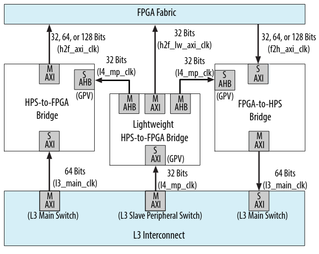
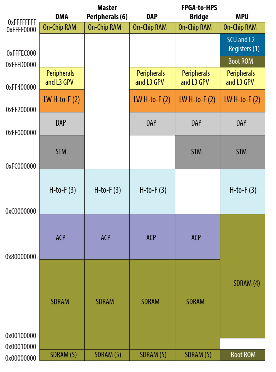
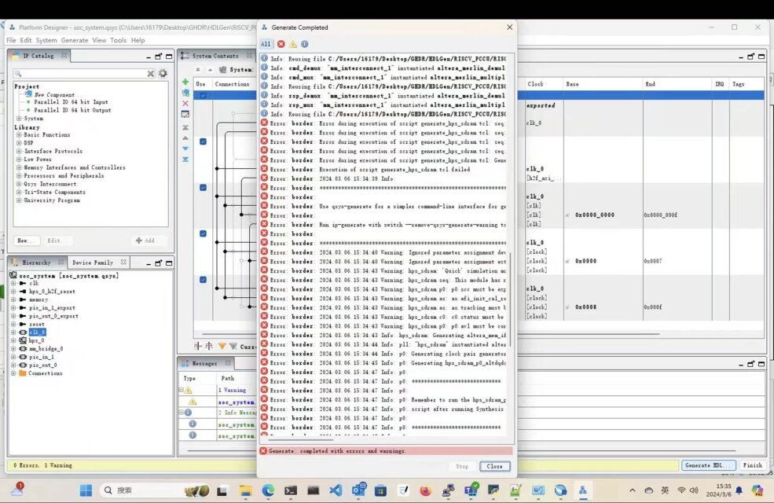
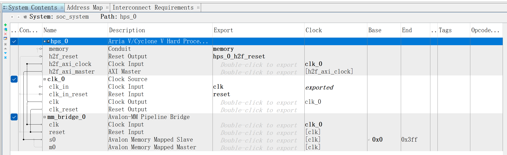
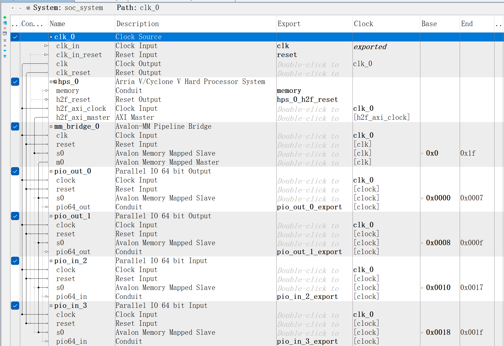

<h1 style="text-align: center">Exploring a Prototype Process for Automating SoC Application Development on the DE10 Nano.</h1>


<center>Student Name: Chenyang Liu</center>

<center>Student ID: 23105110</center>

<center>Email: c.liu7@universityofgalway.ie</center>

<center>Supervisor: Fearghal Morgan</center>

<div style="page-break-before: always;"></div>

## Abstract

<p style="text-align:justify; text-justify:inter-ideograph">This thesis explores a method for developing SoC applications on the DE10 Nano. It involves modifying the GHRD to obtain a project template and automating the parsing of the HDLGen ChatGPT project through Python to generate TCL scripts. These scripts are then verified on the DE10 Nano. This automated process alleviates developers from the burden of tedious procedures.</p>

## Contents

[TOC]

## Introduction

<p style="text-align:justify; text-justify:inter-ideograph">In traditional HDL teaching, students often must focus on many details beyond the core learning objectives, such as spending excessive time on how to use EDA tools and delving into minute syntactical details of HDL. HDLGen_ChatGPT is a tool designed by Fearghal Morgan (HDLGen-ChatGPT, 2023) that streamlines this process; with the aid of HDLGen_ChatGPT and a large language model, students need only concentrate on designing digital circuits and writing pseudo-code. They would then proceed to synthesis and simulation within the AMD Vivado EDA environment.</p>

<p style="text-align:justify; text-justify:inter-ideograph">Students initially design Data Flow Diagrams, create Signal Dictionaries, and develop Finite State Machines. Subsequently, using the GUI program in HDLGen_ChatGPT, they design modules comprising input and output signals, internal signals, and their architecture. For each Process, they define sensitive signals and output signals, along with writing corresponding pseudo-code. Similarly, the Testbench is also written in pseudo-code within the HDLGen_ChatGPT interface.</p>


<p style="text-align:justify; text-justify:inter-ideograph">HDLGen_ChatGPT then generates prompts based on the student's design, which are submitted to the large language model. The model subsequently produces executable HDL code. Finally, HDLGen_ChatGPT automatically sets up the EDA project and launches the EDA tool (AMD Vivado). The student then completes the synthesis and simulation stages within the EDA tool. Another advantage brought by such a workflow is that students can conveniently switch between different HDLs (VHDL, Verilog, SystemVerilog, Chisel).</p>

<p style="text-align:justify; text-justify:inter-ideograph">However, this design flow is currently incomplete; it has not been adapted to work with Intel's EDA tools, and the process does not encompass verification on actual FPGA hardware. Those are precisely the issue that this project aims to address.</p>

<p style="text-align:justify; text-justify:inter-ideograph">This project aims to refine the workflow for digital circuit design, verification, and execution on a development board using HDLGen_ChatGPT. It involves designing Data Flow Diagrams (DFDs) and Finite State Machines (FSMs) within the HDLGen_ChatGPT platform, as well as drafting pseudocode. Based on these DFDs, FSMs, and pseudocode, prompts are generated for submission to a large language model that subsequently produces High-Level Description Language (HDL) code. The process is furthered by executing pre-written TCL scripts to initiate both AMD and Intel's Electronic Design Automation (EDA) tools (Vivado and Quartus), which generate necessary C language files and Linux Drivers for a System-on-Chip (SoC) application running on the DE10-Nano board. Finally, through a user interface written in either C or Python, the performance of the SoC can be monitored on the DE10-Nano board.</p>

<p style="text-align:justify; text-justify:inter-ideograph">This project is merely a part of a more comprehensive project which encompasses the development of GUIs, front-end drawing functionalities, as well as the adaptation of AMD EDA tools and the PYNQ platform for AMD development boards. However, within the scope of this particular project, it solely focuses on the adaptation of Intel EDA tools and the corresponding Development Kit. The DE10-Nano from Intel has been selected as the Development Kit for this endeavor. The choice of DE10-Nano is due to its widespread popularity and ample references in the educational market, where it serves as an effective teaching tool. Notably, the DE10-Nano consists of two parts: a traditional FPGA and an HPS (Hard Processor System) that incorporates dual Cortex-A9 cores. This means the DE10-Nano can run Linux, thereby allowing it to align with the PYNQ aspect of the broader project as illustrated in Figure 1. Furthermore, the presence of Linux facilitates the verification process for the FPGA. (Intel Corporation, n.d.)</p>

<p style="text-align:justify; text-justify:inter-ideograph">In the AMD segment of the boarder entire project, PYNQ has been chosen as part of the development kit. It aims to simplify the development process for ZYNQ's All Programmable System-on-Chip (SoC) and enables developers to program and control FPGA hardware directly using Python language. PYNQ combines traditional hardware description languages (such as VHDL or Verilog) design workflows with the high-level programming language Python, making it easier for software engineers, data scientists, and non-traditional FPGA designers to leverage the powerful parallel processing capabilities and real-time performance of FPGAs.</p>

<p style="text-align:justify; text-justify:inter-ideograph">PYNQ offers an interface that allows users to easily monitor the status of the entire PYNQ development board and send data from the ARM processor on PYNQ to the FPGA via Python. Although the DE10 Nano is similar to PYNQ, featuring both an ARM processor and an FPGA, it does not provide a user-friendly method for data exchange from the ARM processor to the FPGA. This report presents an automated workflow for FPGA development tailored to the DE10 Nano platform. The proposed methodology involves a Python script that parses the HDLGen_ChatGPT project, subsequently generating a Quartus project which can compile into a bitstream file. Furthermore, it facilitates the transmission and reception of data to and from the FPGA on the DE10 Nano via Python or Jupyter Notebook, thereby streamlining the development and interaction process.</p>

<p style="text-align:justify; text-justify:inter-ideograph">In brief, the way to develop this automatic development process can be encapsulated as follows:</p>

* Create a Linux image and flash it onto an SD card.
* Modify the GHRD to obtain the template.
* Retrieve TCL scripts from the template.
* Build a Python script to generate the TCL script and batch file.
* Create a shell script to make the process of programming a bit stream file automatically.
* Write to or read from memory In Linux running on DE10-Nano by modify the `/dev/mem` file.

<p style="text-align:justify; text-justify:inter-ideograph">Though Terasic provided a Linux image for the DE10 Nano, the image lacks documentation. Within the scope of this project, it is imperative to configure the network and leverage several third-party libraries. Customizing our own Linux image would accommodate these requirements, whereas utilizing the pre-configured image provided by Terasic poses significant challenges in achieving the same. Furthermore, a customizing image also affords us the flexibility to effortlessly adjust the image as per our needs.</p>

<p style="text-align:justify; text-justify:inter-ideograph">GHRD, short for golden hardware reference design, contains a series of prebuilt modules that can directly run on the real DE10 Nano after being compiled. Developer can quickly set up their design by modifying the golden hardware. Not all modules are necessary in this project so it is necessary to trim GHRD to get a barebone.</p>

<p style="text-align:justify; text-justify:inter-ideograph">Developer can add their design to barebone and do some necessary modifications. Then, they can compile the project to get the programmable file. TCL script is a key to making this process automatic. After mannually setting up the Quartus project, a TCL script to set up this project can be retrieved from Quartus. The regulation behind the TCL script is obvious. Writing a Python program to generate a TCL script based on the user's design is achievable.</p>

<p style="text-align:justify; text-justify:inter-ideograph">After compile the project and obtain the bit stream file. The Linux running on DE10 Nano allows user to control DE10 Nano and send files into it by ssh. Following the transmission of the bit stream file into the DE10 Nano, a sequence of procedures is necessitated to configure this bit stream file onto the FPGA. The procedures can be integrated into a shell script.</p>

<p style="text-align:justify; text-justify:inter-ideograph">The primary objective of employing Linux on DE10 Nano is to facilitate efficient data transfer to FPGA and get the output data therefrom. The methodology employed for data exchange between FPGA and Linux is reading from and writing to the <code>/dev/mem</code> file interfaced with the FPGA. This report introduces how to use Python to achieve this.</p>

## Chapter 1, Environment Preparation

### 1.1 DE10 Nano Introduce

<p style="text-align:justify; text-justify:inter-ideograph">As discussed in the introduction section, The DE10 Nano SoC integrates a duel-core ARM process which enables the DE10 Nano to operate under the Linux. </p>

<blockquote>
    <p style="text-align:justify; text-justify:inter-ideograph">
    Altera’s SoC integrates an ARM-based hard processor system (HPS) consisting of processor, peripherals and memory interfaces tied seamlessly with the FPGA fabric using a high-bandwidth interconnect backbone.
    </p>
    <cite><a herf="https://www.terasic.com.tw/cgi-bin/page/archive.pl?Language=English&No=1046">—— terasic.com</a></cite>
</blockquote>
<p style="text-align:justify; text-justify:inter-ideograph">Data transmission to, or acquisition from, the FPGA is feasible via Linux executed on the HPS. The SoC aboard the DE10 Nano, a Cyclone V, furnishes three bridges enabling data exchange between the HPS and FPGA. In this context, we employ the HPS-to-FPGA bridge, which presents an AXI master interface capable of interfacing with AXI or Avalon-MM slave interfaces embedded within the FPGA fabric.</p>



<center>Figure 3, Block Diagram of HPS-FPGA Bridge, Cite from <a herf="https://www.intel.com/content/www/us/en/docs/programmable/683126/21-2/hps-fpga-bridges-block-diagram-and-system.html">Cyclone V Reference Manual</a></center>

<p style="text-align:justify; text-justify:inter-ideograph">The picture below demonstrates the address maps of Cyclone V which is the chip on DE10 Nano. The concept of an address map, exemplified by the HPS-to-FPGA bridge, can be explained that for data transmission between HPS and FPGA via this bridge, one would utilize the memory region spanning from address 0xC0000000 to 0xFC000000, as depicted in the referenced diagram (noted by the light blue "H-to-F" section). A simple calculation reveals this memory span to be 960 MB in size. The HPS-to-FPGA bridge accesses data specifically within this mapped area. Further information on this process will be elaborated upon in Section 2.1.</p>



<center>Figure 4, Address Maps for System Interconnect Masters, Cite from <a herf="https://www.intel.com/content/www/us/en/docs/programmable/683126/21-2/hps-fpga-bridges-block-diagram-and-system.html">Cyclone V Reference Manual</a></center>

### 1.2 Linux Image Creation

<p style="text-align:justify; text-justify:inter-ideograph">Creating a Linux image can be a complex process. This tutorial (<a herf="https://github.com/zangman/de10-nano/blob/master/docs/Building-Embedded-Linux.md">Zangman, Building Embadded Linux</a>) serves as an excellent reference, and rather than repeating its content here, this document will provide additional explanations and clarifications.</p>

<p style="text-align:justify; text-justify:inter-ideograph">You must create your own Linux image. Once created, the size of the image cannot be modified. To install software such as Python and Jupyter Notebook, it is necessary to create an image with a capacity greater than 10GB.</p>

#### 1.2.1 U-Boot

<p style="text-align:justify; text-justify:inter-ideograph">When configuring U-Boot for the DE10 Nano, it is necessary to assign a MAC address, but it is not essential to flash the FPGA during U-Boot startup. In the future, the DE10 Nano will operate in the cloud, allowing users to access the DE10 Nano over the network and flash the FPGA during system runtime. Therefore, this step can be omitted when setting up U-Boot.</p>

#### 1.2.2 Compile The Kernel

<p style="text-align:justify; text-justify:inter-ideograph">When configuring the kernel, a crucial step is to enable configfs. Configfs is an in-memory virtual file system, which, as discussed in section 2.2.1, allows for the configuration of the FPGA during system runtime.</p>

#### 1.2.3 Device Tree

The definition of device tree is clearly provided by Wikipedia.

<blockquote>
    <p style="text-align:justify; text-justify:inter-ideograph">Devicetree is a datastructure describing the hardware components of a particular computer so that operating system's kernal can use and manage those components, including the CPU or CPUs, the memory, the buses and the integrated peripherals.</p>
    <p style="text-align:justify; text-justify:inter-ideograph">Given a currect device tree, the same compiled kernal can support different hardware configuration within a wider architecture family.</p>
</blockquote>

<p style="text-align:justify; text-justify:inter-ideograph">Device tree is mandatory for ARM devices as a remedy for vast number of forks by move the significant part of hardware description out of the kernal binary. The hardware description move into the compiled device tree blob, which is handed to the kernal by boot loader.</p>

<p style="text-align:justify; text-justify:inter-ideograph">In section 2.2.1, we load the bitstream file into the FPGA during system runtime by configuring the Device Tree Overlay.</p>

### 1.3 EDA Tools

<p style="text-align:justify; text-justify:inter-ideograph">The Electronic Design Automation (EDA) tool employed in this project is Quartus Prime Lite. There are numerous tutorials available online on how to utilize this EDA tool; however, several important points require attention:</p>

<p style="text-align:justify; text-justify:inter-ideograph">1. Users operating on Windows systems must install Windows Subsystem for Linux (WSL) 1 and avoid upgrading to WSL 2, as NIOS II is incompatible with WSL 2. Failure to adhere to this could result in errors as illustrated below. (<a herf="https://www.intel.com/content/www/us/en/docs/programmable/683525/21-3/installing-windows-subsystem-for-linux.html">Nios II Software Developer Handbook</a>)</p>



<center>Figure 5, NIOS II Error</center>

<p style="text-align:justify; text-justify:inter-ideograph">2. During the development of this project, Quartus Prime Lite version 22 was used. Post-project, Intel released version 23, which has been tested and found to contain TCL commands that differ from those in version 22. To ensure compatibility with this project's code, it is advised to use Quartus Prime Lite version 22.</p>

### 1.4 System Barebone Creation

<p style="text-align:justify; text-justify:inter-ideograph">Open-source communities supply a commendable guide on acquiring project  templates (<a herf="https://github.com/zangman/de10-nano/blob/master/docs/Simple-Hardware-Adder_-Initial-Project-Setup.md">Zangman, Initial Project Setup</a>). This report refrains from duplicating those steps.</p>

``````verilog
//=======================================================
//  This code is generated by Terasic System Builder
//=======================================================

module DE10_NANO_SoC_GHRD(

    //////////// CLOCK //////////
    input               FPGA_CLK1_50,
    input               FPGA_CLK2_50,
    input               FPGA_CLK3_50,

    //////////// HPS //////////
    output   [14: 0]    HPS_DDR3_ADDR,
    output   [ 2: 0]    HPS_DDR3_BA,
    output              HPS_DDR3_CAS_N,
    output              HPS_DDR3_CK_N,
    output              HPS_DDR3_CK_P,
    output              HPS_DDR3_CKE,
    output              HPS_DDR3_CS_N,
    output   [ 3: 0]    HPS_DDR3_DM,
    inout    [31: 0]    HPS_DDR3_DQ,
    inout    [ 3: 0]    HPS_DDR3_DQS_N,
    inout    [ 3: 0]    HPS_DDR3_DQS_P,
    output              HPS_DDR3_ODT,
    output              HPS_DDR3_RAS_N,
    output              HPS_DDR3_RESET_N,
    input               HPS_DDR3_RZQ,
    output              HPS_DDR3_WE_N,

    //////////// LED //////////
    output   [ 7: 0]    LED
);

//=======================================================
//  REG/WIRE declarations
//=======================================================
wire hps_fpga_reset_n;
wire                fpga_clk_50;
wire [6:0]	fpga_led_internal;

// connection of internal logics
assign LED[7: 1] = fpga_led_internal;
assign fpga_clk_50 = FPGA_CLK1_50;

//wire [63:0] adder_a_export;
//wire [63:0] adder_b_export;
//wire [63:0] adder_sum_export;
    
//adder my_adder (
//	.adder_a(adder_a_export),
//	.adder_b(adder_b_export),
//	.adder_sum(adder_sum_export)
//);

//=======================================================
//  Structural coding
//=======================================================
soc_system u0(

				// Adder
				//.adder_a_export(adder_a_export),
				//.adder_b_export(adder_b_export),
				//.adder_sum_export(adder_sum_export),

               //Clock&Reset
               .clk_clk(FPGA_CLK1_50),                     //                            clk.clk
               .reset_reset_n(hps_fpga_reset_n),           //                          reset.reset_n
               //HPS ddr3
               .memory_mem_a(HPS_DDR3_ADDR),               //                         memory.mem_a
               .memory_mem_ba(HPS_DDR3_BA),                //                               .mem_ba
               .memory_mem_ck(HPS_DDR3_CK_P),              //                               .mem_ck
               .memory_mem_ck_n(HPS_DDR3_CK_N),            //                               .mem_ck_n
               .memory_mem_cke(HPS_DDR3_CKE),              //                               .mem_cke
               .memory_mem_cs_n(HPS_DDR3_CS_N),            //                               .mem_cs_n
               .memory_mem_ras_n(HPS_DDR3_RAS_N),          //                               .mem_ras_n
               .memory_mem_cas_n(HPS_DDR3_CAS_N),          //                               .mem_cas_n
               .memory_mem_we_n(HPS_DDR3_WE_N),            //                               .mem_we_n
               .memory_mem_reset_n(HPS_DDR3_RESET_N),      //                               .mem_reset_n
               .memory_mem_dq(HPS_DDR3_DQ),                //                               .mem_dq
               .memory_mem_dqs(HPS_DDR3_DQS_P),            //                               .mem_dqs
               .memory_mem_dqs_n(HPS_DDR3_DQS_N),          //                               .mem_dqs_n
               .memory_mem_odt(HPS_DDR3_ODT),              //                               .mem_odt
               .memory_mem_dm(HPS_DDR3_DM),                //                               .mem_dm
               .memory_oct_rzqin(HPS_DDR3_RZQ),            //                               .oct_rzqin

               .hps_0_h2f_reset_reset_n(hps_fpga_reset_n)  //                hps_0_h2f_reset.reset_n

           );


reg [25: 0] counter;
reg led_level;
always @(posedge fpga_clk_50 or negedge hps_fpga_reset_n) begin
    if (~hps_fpga_reset_n) begin
        counter <= 0;
        led_level <= 0;
    end

    else if (counter == 24999999) begin
        counter <= 0;
        led_level <= ~led_level;
    end
    else
        counter <= counter + 1'b1;
end

assign LED[0] = led_level;


endmodule
``````

<center>Code of the Top Module</center>



<center>Figure 6, Platform Designer of GHRD after Trim</center>

## Chapter 2, Work Process

### 2.1 Quartus Project

<p style="text-align:justify; text-justify:inter-ideograph">Users can combine their projects with a template in a few simple steps to run their designs on the DE10 Nano. Initially, users must add their HDL files to the template project. Subsequently, PIOs should be added in the platform designer according to their design. It is important to note that the direction of PIOs in the platform designer is opposite to the direction of the Ports in the user's design. This is because the direction of Ports is relative to the user's digital circuit, whereas the direction of PIOs is relative to the HPS.</p>



<center>Figure 7, Platform Designer System for FIFO</center>


<p style="text-align:justify; text-justify:inter-ideograph">Next, generate HDL code within the Platform Designer. Subsequently, instantiate the user's HDL and connect the user-created component with the component generated by the Platform Designer in the top module. The following code illustrates this connection process.</p>

``````verilog
// ...
assign fpga_clk_50 = FPGA_CLK1_50;

wire [63:0] pio_out_0_export;
wire [63:0] pio_out_1_export;
wire [63:0] pio_in_2_export;
wire [63:0] pio_in_3_export;
FIFOTopModule my_FIFOTopModule (
    .clk(fpga_clk_50),
    .rst(pio_out_0_export[63:63]),
    .FIFORead(pio_out_0_export[62:62]),
    .FIFOWrite(pio_out_0_export[61:61]),
    .FIFODataIn(pio_out_1_export[63:0]),
    .FIFOFull(pio_in_2_export[63:63]),
    .FIFOEmpty(pio_in_2_export[62:62]),
    .FIFODataOut(pio_in_3_export[63:0]),
);

soc_system u0(
// ...
``````

### 2.2 HPS-FPGA Data Transmission

#### 2.2.1 Configure the Bitstream File

<p style="text-align:justify; text-justify:inter-ideograph">The subsequential step of getting the bitstream file is configuring the FPGA.</p>

<p style="text-align:justify; text-justify:inter-ideograph">This project employs a dynamic method of managing device tree overlays, which allows users to configure FPGA dynamically during the runtime of a Linux system. A device tree overlay is a mechanism that enables the addition, modification, or deletion of nodes and properties in a device tree without altering the original device tree blob (DTB). This facilitates the configuration or expansion of hardware during runtime. The management of these dynamic device tree overlays is achieved through configfs. Configfs is an in-memory virtual file system used to configure kernel components dynamically while the system is operational, and it similarly facilitates the runtime configuration of device tree overlays. It is important to note that configurations made via configfs are not retained after a system reboot, due to its reliance on an in-memory file system.</p>

<p style="text-align:justify; text-justify:inter-ideograph">The following code defines a device tree overlay, which constitutes a segment of a device tree that can be integrated into other device trees as an extension. In the U-Boot file <code>socfpga.dtsi</code>, there is a node named <code>/soc/base_fpga_region</code>; this node serves as the target path for the insertion of the fragment into the device tree. This device tree file specifies the location of the bitstream file, and upon loading the device tree overlay, the Linux kernel automatically loads the configuration RBF file for the FPGA, as directed by the instructions within the device tree.</p>

```java
/*
 * Device Tree Source (DTS) syntax version declaration.
 */
/dts-v1/;

/*
 * Designates this as a plugin section for compatibility with certain parsers.
 */
/plugin/;

/*
 * Root node of the device tree description.
 */
/ {
    /*
     * Fragment definition with an index of 0, used to overlay properties
     * onto a specific target in the device tree.
     */
    fragment@0 {
        /* 
         * Specifies the path where this overlay should be applied within the device tree.
         * In this case, it targets the FPGA base region under the SoC node.
         */
        target-path = "/soc/base_fpga_region";

        /* 
         * The __overlay__ section contains properties to be added or modified at
         * the target path.
         */
        __overlay__ {
            /* 
             * Defines the number of cells used to represent addresses in this node.
             * Here, it's set to <1>, indicating 32-bit addressing.
             */
            #address-cells = <1>;

            /* 
             * Defines the number of cells used to represent sizes in this node.
             * Similarly, it's set to <1>, indicating 32-bit size representation.
             */
            #size-cells = <1>;

            /* 
             * Assigns a name to the firmware image associated with this overlay.
             * The firmware named "fifo.rbf" will be loaded at the specified address.
             */
            firmware-name = "fifo.rbf";
        };
    };
};
```

<p style="text-align:justify; text-justify:inter-ideograph">Following the compilation of the device tree overlay file, a DTBO file is generated.</p>

``` shell
dtc -O dtb -o fifo.dtbo -b 0 -@ fifo.dtso
```

<p style="text-align:justify; text-justify:inter-ideograph">A directory, <code>/lib/firmware</code>, is created to store the DTBO and RBF files.</p>

```shell
mkdir -p /lib/fireware
cp fifo.dtbo /lib/firmware
cp fifo.rbf /lib/firmware
```

<p style="text-align:justify; text-justify:inter-ideograph">Additionally, a <code>/config</code> directory is established, and the configfs filesystem is mounted to this directory.</p>

``` shell
mkdir -p /config
mount -t configfs configfs /config
```

<p style="text-align:justify; text-justify:inter-ideograph">Subsequently, one must navigate to the device tree overlay directory under <code>/config</code>, create a directory named <code>fifo</code>, and write the <code>fifo.dtbo</code> file to <code>fifo/path</code>.</p>

``` shell
cd /config/device-tree/overlays
mkdir fifo
echo -n "fifo.dtbo" > fifo/path
```

<p style="text-align:justify; text-justify:inter-ideograph">Upon completion, the Linux kernel automatically loads the RBF file into the FPGA. This process can be verified by examining the contents of the <code>fifo/state</code> file.</p>

``` shell
cat fifo/status
```

<p style="text-align:justify; text-justify:inter-ideograph">To update the FPGA, the <code>fifo</code> directory should be deleted and the aforementioned steps repeated.</p>

``` shell
rm fifo
```

#### 2.2.2 Access Physical Memory

<p style="text-align:justify; text-justify:inter-ideograph"><code>/dev/mem</code> provides access to the system's physical memory.</p>

<blockquote>
    <p style="text-align:justify; text-justify:inter-ideograph">
        <code>/dev/mem</code> is a character device file that is an image of the main memory of the computer.  It may be used, for example, to examine (and even patch) the system.
    </p>
    <cite><a herf="https://man7.org/linux/man-pages/man4/mem.4.html">—— Linux man page</a></cite>
</blockquote>

<p style="text-align:justify; text-justify:inter-ideograph">A segment of Python code below illustrates the principle behind data interchange between the FPGA and HPS. This code section accomplishes data exchange by directly accessing the <code>/dev/mem</code> file to read and write memory, facilitating communication with the FPGA.</p>

<p style="text-align:justify; text-justify:inter-ideograph">
    As elaborated in Section 1.1, a 960 MB memory space, commencing at address 0xC0000000, is designated for data transfers between the HPS and FPGA. Suppose a digital circuit exists on the FPGA, with a 64-bit input and a 64-bit output, aligned with 64-bit Parallel IO. Consequently, the 16-byte memory region starting at 0xC0000000 serves as the shared memory space for data exchange with this digital circuit, as implied in line 9 of the following Python code snippet.
</p>

<p style="text-align:justify; text-justify:inter-ideograph">A variable <code>0xdeadbeefdeadbeef</code> of type <code>int</code> is instantiated and converted into a sequence of bytes in little-endian format, considering data storage on ARM architecture processors follows little-endian byte order. Assuming the offset for the first output PIO is 0, and given the PIO width of 64 bits or 8 bytes, line 16 writes this data into <code>mem_mapped[:8]</code>.</p>

<p style="text-align:justify; text-justify:inter-ideograph">Similarly, to retrieve data as depicted in line 19, assuming an input PIO offset of 8, the characters from <code>mem_mapped[8:16]</code> are extracted and reassembled from the little-endian byte stream to obtain the data retrieved from FPGA.</p>


```Python
# Import required libraries
import mmap
import struct

# Open the memory file at a specific address with read and write access,
# without buffering, for direct memory access.
with open('/dev/mem', 'r+b', buffering=0) as f:
    # Map 16 bytes of memory starting at the given offset (0xC0000000)
    mem_mapped = mmap.mmap(f.fileno(), length=16, offset=0xC0000000)
    
    # Define a hexadecimal value to write into memory
    value_deadbeef = 0xdeadbeefdeadbeef
    # Pack the value into a byte string in little-endian format
    output_data_byte_string = struct.pack('<Q', value_deadbeef)
    # Write the byte string into the first 8 bytes of the mapped memory
    mem_mapped[:8] = output_data_byte_string

    # Read the next 8 bytes from the mapped memory into a byte string
    input_data_byte_string = mem_mapped[8:16]
    # Unpack the byte string from memory back into an integer in little-endian format
    input_data = struct.unpack('<Q', input_data_byte_string)[0]

    # Close the memory map to release the memory mapping
    mem_mapped.close()
```

## Chapter 3, Program Design

<p style="text-align:justify; text-justify:inter-ideograph">This thesis provides a Python script that automatically generates a Quartus project. The script compiles the project into a programmable file, which is then used to reflash the FPGA on the DE10-Nano. Additionally, it enables communication between the FPGA and the Linux running on the DE10-Nano's HPS.</p>

<p style="text-align:justify; text-justify:inter-ideograph">The program is a sophisticated state machine, necessitating the development of exhaustive documentation detailing its operations. Of particular note in Windows, the default file path separator is the backslash (\). When such paths are directly imparted to Quartus, they are misconstrued as escape characters, leading to errors. To avoid this issue within Python, the advisable practice is to employ the pathlib module for path manipulations, ensuring paths adhere to the POSIX format. Additionally, in legacy HDLGen projects, relative paths may be utilized, mandating the implementation of suitable mechanisms within the program to handle these cases appropriately. If you want to get the code, please go to the Appendix Part to access my Git hub repository.</p>

<p style="text-align:justify; text-justify:inter-ideograph">Based on the process discussed in chapter 2, this Python program should have the following functions.</p>

<ol>
    <li style="text-align:justify; text-justify:inter-ideograph">Retrieve necessery information for the HDLGen-ChatGPT project, including the user's design name, paths to the top-module and sub-module HDL files, IO ports and the testbench.</li>
    <li style="text-align:justify; text-justify:inter-ideograph">Connect the variety-width ports (ranging from 1 to 64 bits) to 64-bit PIOs, recording the connections details.</li>
    <li style="text-align:justify; text-justify:inter-ideograph">Create a project folder and subfolders. Including an IP folder containing the HDL for PIOs.</li>
    <li style="text-align:justify; text-justify:inter-ideograph">Generate the '_hw.tcl' TCL script for the PIOs within the project folder.</li>
    <li style="text-align:justify; text-justify:inter-ideograph">Create the whole Quartus project TCL, which will include the HDL files into the Quartus project.</li>
    <li style="text-align:justify; text-justify:inter-ideograph">Generate a TCL script for the Platform Designer based on the connection details.</li>
    <li style="text-align:justify; text-justify:inter-ideograph">Create a top-level HDL file that act as a bridge between the user's design and the components generated by the Platform Designer.</li>
    <li style="text-align:justify; text-justify:inter-ideograph">Generate a BAT file to automate the generation and compilation of the Quartus project.</li>
    <li style="text-align:justify; text-justify:inter-ideograph">Create an XML file documenting the testbench and connections between ports and PIOs.</li>
</ol>
<p style="text-align:justify; text-justify:inter-ideograph">The functions above was placed in the different module.</p>

<ul>
    <li style="text-align:justify; text-justify:inter-ideograph"><b>HDLGenDataType.py: </b>this module contains several classes as the abstract of data type including port and PIO.</li>
    <ul>
        <li style="text-align:justify; text-justify:inter-ideograph"><b>Port: </b>abstract of the Port.</li>
        <li style="text-align:justify; text-justify:inter-ideograph"><b>PIO: </b>abstract of PIO.</li>
        <li style="text-align:justify; text-justify:inter-ideograph"><b>PortPIOAdapter: </b>an adapter charge for connecting port and PIO .</li>
    </ul>
    <li style="text-align:justify; text-justify:inter-ideograph"><b>HDLGenProjectParser.py: </b>this module aims to parse the HDLGen project to get the necessery information. It has the following classes.</li>
    <ul>
        <li style="text-align:justify; text-justify:inter-ideograph"><b>PathBuilder: </b>a class aims manage the path which converts relative path into the absolute path and save path as a string in posix format.</li>
        <li style="text-align:justify; text-justify:inter-ideograph"><b>HDLGenProjectParser: </b>a class aims to parse the HDLgen project from an xml file.</li>
        <li style="text-align:justify; text-justify:inter-ideograph"><b>HDLGenEnvironmentParser: </b>a class aims to parse the HDLgen project environment from an xml file.</li>
    </ul>
    <li style="text-align:justify; text-justify:inter-ideograph"><b>QuartusProjectGenerator.py: </b>this module ...</li>
    <ul>
        <li style="text-align:justify; text-justify:inter-ideograph"><b>Connection: </b>This class abstracts port-PIO connecitons, recording which port is connected to which PIO and identifying the start bit of the connection.</li>
        <li style="text-align:justify; text-justify:inter-ideograph"><b>Quartus: </b>This class records the paths of Quartus' executable file.</li>
        <li style="text-align:justify; text-justify:inter-ideograph"><b>FolderStructureBuilder: </b>This class will construct the folder for the quartus project. It will create quartus project and ip folder and write hdl and hw.tcl files into it.</li>
        <li style="text-align:justify; text-justify:inter-ideograph"><b>QuartusTCLScriptGenerator: </b>This class generates TCL for Quartus projects based on the connection information between Ports and PIOs.</li>
        <li style="text-align:justify; text-justify:inter-ideograph"><b>QsysTCLScriptGenerator: </b>This class generates TCL for Platform Designer based on the connection information between Ports and PIOs.</li>
        <li style="text-align:justify; text-justify:inter-ideograph"><b>TopLevelHdlGenerator: </b>This class generates Verilog file as a top module based on the connection information between Ports and PIOs.</li>
        <li style="text-align:justify; text-justify:inter-ideograph"><b>BatchFileGenerator: </b>This class generates a batch script for Windows. The script enables Quartus to execute TCL scripts, automatically generating and compiling Quartus projects.</li>
        <li style="text-align:justify; text-justify:inter-ideograph"><b>XMLDocumentation: </b>This class saves the XML connection information into an XML file, which is then transferred to the DE10 Nano. The program on the DE10 Nano parses this XML file to facilitate automated testing based on the testbench.</li>
        <li style="text-align:justify; text-justify:inter-ideograph"><b>QuartusProjectManager: </b>This class acts as the manager for the entire program, sequentially invoking functions to parse the HDLGen_ChatGPT project, generate connection functions, and create Quartus projects. Before executing connections, the class sorts Ports to reduce the number of PIOs generated.</li>
    </ul>
</ul>


**Details of classes:**

<center>Classes in HDLGenDataType.py</center>

<table>
    <tr>
        <td><b>Class name</b></td>
        <td><b>Port</b></td>
    </tr>
    <tr>
    	<td></td>
        <td></td>
        <td><b>Description</b></td>
    </tr>
    <tr>
        <td rowspan="4"><b>Member variable</b></td>
        <td>name: str</td>
        <td>The name of this IO port.</td>
    </tr>
    <tr>
    	<td>direction: str</td>
        <td style="text-align:justify; text-justify:inter-ideograph">An input port or an output port. The values are restricted to 'in' and 'out'.</td>
    </tr>
    <tr>
    	<td>type: str</td>
        <td>A single bit or a bus.</td>
    </tr>
    <tr>
    	<td>width: int</td>
		<td>The width of the signal.</td>
    </tr>
    <tr>
        <td rowspan="3"><b>Member method</b></td>
        <td>init()</td>
        <td>Initial the member variable by calling Getter/Setter method.</td>
    </tr>
    <tr>
        <td>Getter/Setter</td>
        <td>Get/set method of the memver variables.</td>
    </tr>
    <tr>
    	<td>__type_parser(value:str) -> bool</td>
        <td style="text-align:justify; text-justify:inter-ideograph">Get width of the port with regular expression from the type. This function will be called by Setter of type. It will return false if the parsing is fail.</td>
    </tr>
</table>

<table>
    <tr>
        <td><b>Class name</b></td>
        <td><b>PIO</b></td>
    </tr>
    <tr>
    	<td></td>
        <td></td>
        <td><b>Description</b></td>
    </tr>
    <tr>
        <td rowspan="4"><b>Member variable</b></td>
        <td>name: str</td>
        <td>The name of this PIO.</td>
    </tr>
    <tr>
    	<td>direction: str</td>
        <td style="text-align:justify; text-justify:inter-ideograph">An input PIO or an output PIO. The values are restricted to 'in' and 'out'.</td>
    </tr>
    <tr>
    	<td>address: int</td>
        <td>The bias of address.</td>
    </tr>
    <tr>
    	<td>available_bit: int</td>
		<td style="text-align:justify; text-justify:inter-ideograph">The highest available bit of this PIO. When a port is connected to a PIO, it will connect from higher bit to lower bit. This variable is initialed with 63.</td>
    </tr>
    <tr>
        <td rowspan="5"><b>Member method</b></td>
        <td>init()</td>
        <td style="text-align:justify; text-justify:inter-ideograph">Initial the member variable by calling Getter/Setter method.</td>
    </tr>
    <tr>
        <td>Getter/Setter</td>
        <td>Get/set method of the member variables.</td>
    </tr>
    <tr>
    	<td>connect_port(port: Port) -> int</td>
        <td style="text-align:justify; text-justify:inter-ideograph">This function will receive an instance of Port. After the port was connected on PIO, this function will return the start bit of connect.</td>
    </tr>
    <tr>
    	<td>has_spare_space_for(self, port_width: int) -> bool</td>
        <td style="text-align:justify; text-justify:inter-ideograph">This function is to judge whether this PIO has enough bits to connect with the port.</td>
    </tr>
    <tr>
    	<td>_connect_to_available_bits(self, port: Port) -> int</td>
        <td style="text-align:justify; text-justify:inter-ideograph">This function will be called by connect_port(). It will modity the available_bit after the connection and return the start bit of connect.</td>
    </tr>
</table>

<table>
    <tr>
        <td><b>Class name</b></td>
        <td><b>PortPIOAdapter</b></td>
    </tr>
    <tr>
    	<td></td>
        <td></td>
        <td><b>Description</b></td>
    </tr>
    <tr>
        <td><b>Member variable</b></td>
        <td>pios: List[PIO]</td>
        <td style="text-align:justify; text-justify:inter-ideograph">This list contains PIOs which were already created. After a PIO has been created, the PIO will be appended in this list.</td>
    </tr>
        <td rowspan="4"><b>Member method</b></td>
        <td>_direction_convert(mode: str) -> str</td>
        <td style="text-align:justify; text-justify:inter-ideograph">This function will receive a string 'in' or 'out', and upon receiving one of them, it will return another. Because the direction of user's design is opposite with PIO's direciton.</td>
    </tr>
    <tr>
        <td>_find_or_create_pio_for_port(self, port: Port) -> PIO</td>
        <td style="text-align:justify; text-justify:inter-ideograph">This function will return an instance of a PIO. This function first will check out the last PIO in the list pios for whether it has enought bits to connect with the port. If it is true, it will return that PIO. If not, it will create a new instance of PIO and appends it in the List pios.</td>
    </tr>
    <tr>
    	<td>connect_port(self, port: Port) -> Tuple[PIO, int]</td>
        <td style="text-align:justify; text-justify:inter-ideograph">This function will receive an instance of Port, It will connect it with a PIO. First it will get an instance of PIO by calling the function _find_or_create_pio_for_port(). Then it will call the member function of pio, connect_port(), to connect the port and the pio.</td>
    </tr>
</table>


<center>Classes in HDLGenProjectParser.py</center>

<table>
    <tr>
        <td><b>Class name</b></td>
        <td><b>PathBuilder</b></td>
    </tr>
    <tr>
    	<td></td>
        <td></td>
        <td><b>Description</b></td>
    </tr>
    <tr>
        <td><b>Member variable</b></td>
        <td>path: str</td>
        <td>A string to store the path.</td>
    </tr>
    <tr>
        <td rowspan="2"><b>Member method</b></td>
        <td>init()</td>
        <td>Initial the member variable by calling Getter/Setter method.</td>
    </tr>
    <tr>
        <td>Getter/Setter</td>
        <td style="text-align:justify; text-justify:inter-ideograph">Get/set method for the path. First, it will convert it to an absolute path. Then it will convert as a string in posix path format.</td>
    </tr>
</table>

<table>
    <tr>
        <td><b>Class name</b></td>
        <td><b>HDLGenProjectParser</b></td>
    </tr>
    <tr>
    	<td></td>
        <td></td>
        <td><b>Description</b></td>
    </tr>
    <tr>
        <td><b>Member variable</b></td>
        <td>path: str</td>
        <td style="text-align:justify; text-justify:inter-ideograph">A string to store the path of the user's HDLGen project which is an xml file.</td>
    </tr>
    <tr>
        <td rowspan="8"><b>Member method</b></td>
        <td>init()</td>
        <td style="text-align:justify; text-justify:inter-ideograph">Initial the member variable by calling Getter/Setter method.</td>
    </tr>
    <tr>
        <td>Getter/Setter</td>
        <td style="text-align:justify; text-justify:inter-ideograph">Get/set method for the member variable.</td>
    </tr>
    <tr>
        <td>parser(self) -> Tuple[str, str, str, List[Port], str]</td>
        <td style="text-align:justify; text-justify:inter-ideograph">This function aims retrieve series necessery information from the HDLGen project. It will return a couple of values: project_name, top_hdl_path, environment_path, ports, testbench. This function will call the following member functions to get those return values.</td>
    </tr>
    <tr>
    	<td>_design_name_parser(root: Element) -> str</td>
        <td style="text-align:justify; text-justify:inter-ideograph">The function retrieves the design name of users design.</td>
    </tr>
    <tr>
    	<td>_top_level_hdl_parser(root: Element) -> str</td>
        <td style="text-align:justify; text-justify:inter-ideograph">
            The function retrieves the path of HDL file of user's design.<br>
            This function will first retrieve the location of user's HDLGen project. Then retrieve the subfolder of the HDL files.<br>
        </td>
    </tr>
    <tr>
    	<td>_environment_path_parser(root: Element) -> str</td>
        <td style="text-align:justify; text-justify:inter-ideograph">
        	Get the environment path. This function will assume that the environment path is an absolute path.
        </td>
    </tr>
    <tr>
    	<td>_signals_parser(root: Element) -> List[Port]</td>
    	<td style="text-align:justify; text-justify:inter-ideograph">This function will retrieve the signals, then create an instance of port, and return the instance.</td>
    </tr>
    <tr>
    	<td>_testbench_parser(root: Element) -> str</td>
        <td style="text-align:justify; text-justify:inter-ideograph">This function will retrieve a testbench and return it as a string.</td>
    </tr>
</table>

<table>
    <tr>
        <td><b>Class name</b></td>
        <td><b>HDLGenEnvironmentParser</b></td>
    </tr>
    <tr>
    	<td></td>
        <td></td>
        <td><b>Description</b></td>
    </tr>
    <tr>
        <td><b>Member variable</b></td>
        <td>path: str</td>
        <td>A string to store the environment path.</td>
    </tr>
    <tr>
        <td rowspan="3"><b>Member method</b></td>
        <td>init()</td>
        <td>Initial the member variable by calling Getter/Setter method.</td>
    </tr>
    <tr>
        <td>Getter/Setter</td>
        <td style="text-align:justify; text-justify:inter-ideograph">Get/set method for the path. First, it will convert it to an absolute path. Then it will convert as a string in posix path format.</td>
    </tr>
    <tr>
        <td>parser(self) -> List[str]</td>
        <td style="text-align:justify; text-justify:inter-ideograph">Get/set method for the path. First, it will convert it to an absolute path. Then it will convert as a string in posix path format.</td>
    </tr>
</table>
## Chapter 4, Future Work

## Reference

https://github.com/zangman/de10-nano

https://www.intel.com/content/www/us/en/docs/programmable/683126/21-2/hard-processor-system-technical-reference.html

https://man7.org/linux/man-pages/man4/mem.4.html

[Building embedded Linux for the Terasic DE10-Nano (and other Cyclone V SoC FPGAs) | bitlog.it](https://bitlog.it/20170820_building_embedded_linux_for_the_terasic_de10-nano.html)

https://www.intel.com/content/www/us/en/docs/programmable/683525/21-3/installing-windows-subsystem-for-linux.html

## Appendix

### Git Hub Repository

This <a hraf='https://github.com/FeiFeiDan/de10nano_project_generator'>link (https://github.com/FeiFeiDan/de10nano_project_generator)</a> is the Git hub repository of this project. You can invest this repository to get the newest code and the update of this report.
