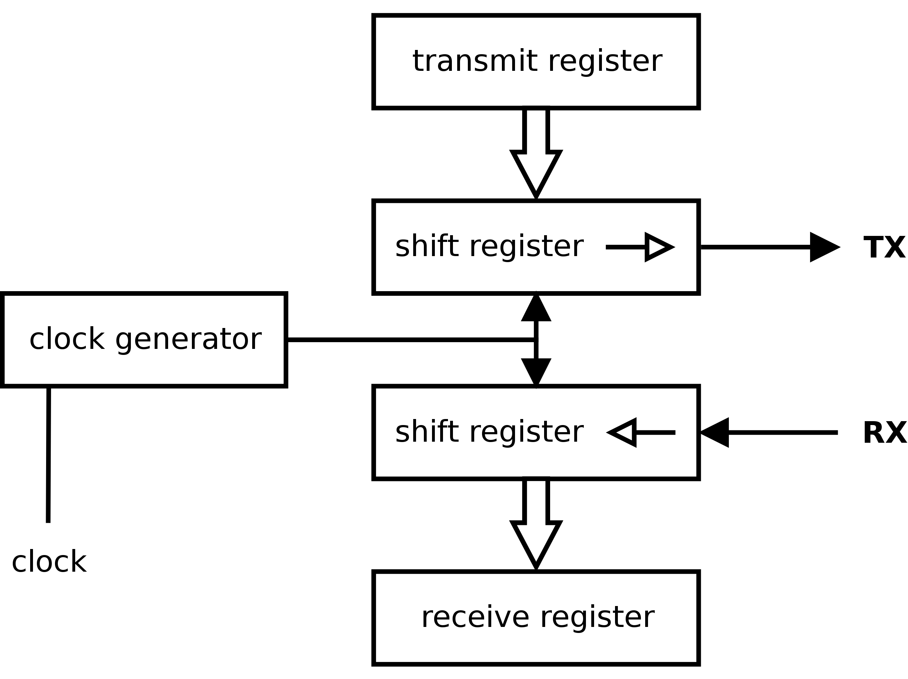

[TOC]

# ARM

## ARM概述

### ARM的含义

公司、架构、指令集

### CISC与RISC

### ARM架构

### ARM的指令集

### 编译原理

## ARM的存储类型

### ARM的数据类型

### 字节序

### ARM的指令存储

## 通用寄存器

### 未备份寄存器

### 备份寄存器

# 通讯协议

## UART通讯协议

<a harf="[Universal asynchronous receiver-transmitter - Wikipedia](https://en.wikipedia.org/wiki/Universal_asynchronous_receiver-transmitter#)">维基百科讲的很清楚。</a>

UART：通用异步收发器（Universal Asynchronous Receiver/Transmitter），顾名思义，其是异步的。

UART是全双工的，支持三种模式：

* simplix
* full duplix
* half duplix

有两根线，一根TXD用于发送，一根RXD用于接收。UART的串行数据传输，不需要使用时钟信号来同步传输，而是依赖于发送设备和接收设备之间预定义的配置。

通信双方只需要采用相同的帧格式和波特率，就能在未共享时钟信号的情况下，仅用两条信号线就可以完成通信过程，因此也可以称之为异步串行通信。

UART双方约定的信息包括：

* 电压，Voltage level
* 波特率，Baud rate
* 奇偶校验位，Parity bit
* 数据位的大小，Data bits size
* 停止位的大小，Stop bits size
* <a harf="[Flow control (data) - Wikipedia](https://en.wikipedia.org/wiki/Flow_control_(data))">Flow control</a> (Stop and wait, Sliding Window)

### 数据帧

UART帧的组成格式：

* idle (logic high 1)
* Start bit (logic low 0)
* Data bits
* Partiy bit
* Stop (logic high 1)

最常见的设置是8 bit的数据位，1 bit的停止位，没有校验位（8N1）。在空闲状态时，线上是高电平，用来表示线和传输位没有被破坏。

在大多数的应用中，LSD被首先传输。但是也有例外。

### UART的结构

UART 结构图

移位寄存器是将串行信号转换为并行信号的方法。

#### 接收器

UART有一个内部时钟信号，用来控制UART的所有操作，这个内部始终信号往往是比特率的8倍或者是16倍。接收器在每一个时钟脉冲都会检查收到信号的状态（是否从高电平的idle状态转换为低电平的start bit）。如果start bit的低电平至少持续了一个bit时间的一半，那就代表着一个新的字符开始传输了。在5到9位数据位被获取了之后，其结果会通过移位寄存器以并行信号的方式传输给系统。

UART不会在通信中共享，时间系统。一般来说，UART的通信双方会在每一次数据线改变的时候同步内部时钟，其不会被当做伪脉冲 (spurious pulse)。

简单的UART不会这么做，其只会在start bit的下降沿同步始终，然后读取每个数据位的中心。

很多UART设备在接收移位寄存器（receiver shift register）和主机中间有一个FIFO。

## I2C通信协议

## CAN总线协议

# C++ I

# C++ II

